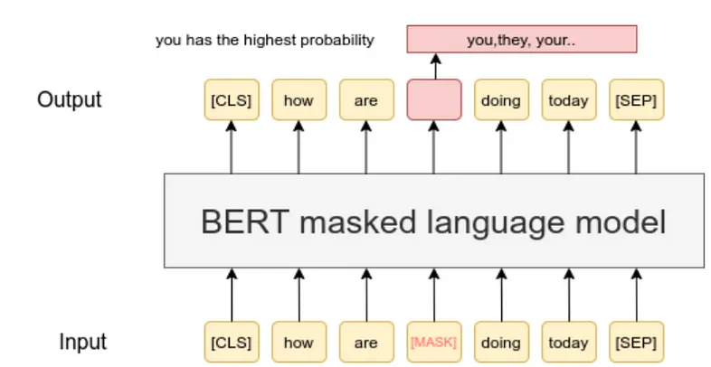
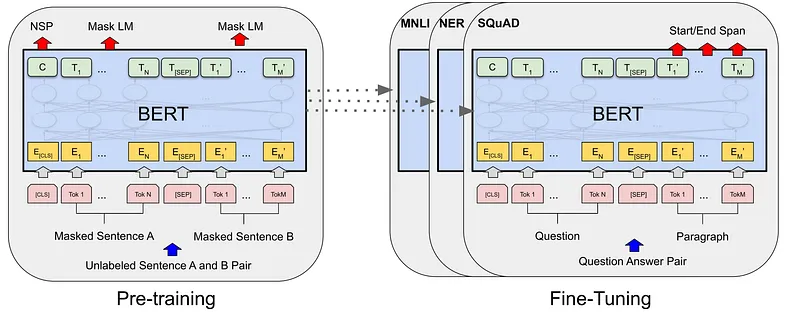

# BERT (Bidirectional Encoder Representations from Transformers) Documentation

## Table of Contents
1. [Introduction](#introduction)
   - What is BERT?
   - How BERT Works
   - Real-World Applications
2. [Model Architecture](#architecture)
   - Transformer Architecture
   - Pre-training & Fine-tuning
   - Model Variants
3. [Setup and Installation](#setup)
   - Prerequisites
   - Model Download
   - Environment Setup
4. [Available Models](#models)
   - Model Types and Sizes
   - Download Links
   - Hardware Requirements
5. [Usage Guide](#usage)
   - Basic Usage
   - Command Line Interface
   - Common Parameters
   - TPU Usage
6. [Tasks and Examples](#tasks)
   - Classification
   - Question Answering
   - Feature Extraction
   - Pre-training
7. [Dataset Preparation](#datasets)
   - Supported Datasets
   - Data Formats
   - Preprocessing Steps
8. [Troubleshooting](#troubleshooting)
   - Common Issues
   - Performance Tips
   - Memory Management

## Introduction <a name="introduction"></a>

BERT (Bidirectional Encoder Representations from Transformers) represents a groundbreaking advancement in Natural Language Processing (NLP), developed by Google AI Language in 2018. It revolutionized how machines understand and process human language by introducing a more sophisticated, context-aware approach that closely mimics human language comprehension.

### The Problem BERT Solves

Before BERT, one of the biggest challenges in NLP was the lack of sufficient training data for specific tasks. While vast amounts of text data exist, creating task-specific datasets (like for sentiment analysis or question answering) often resulted in limited samples. Traditional models required millions of annotated examples to perform well, creating a significant data gap.

BERT solved this through an innovative pre-training approach that allows the model to learn from massive amounts of unannotated text (like Wikipedia and books) and then fine-tune this knowledge for specific tasks with much smaller datasets.

### What Makes BERT Special?

Consider this sentence: "The bank is closed." How do you know if this refers to a financial institution or the edge of a river? As humans, we naturally use the surrounding context to determine the meaning. BERT works similarly, but with a crucial innovation:

### Masked Language Model (MLM) Explained



BERT uses a clever "fill in the blank" approach called Masked Language Model (MLM). Here's how it works:

1. **Input Processing**: 
   - Take a sentence: "[CLS] how are [MASK] doing today [SEP]"
   - The [MASK] token replaces a word we want BERT to predict
   - Special tokens [CLS] and [SEP] mark the beginning and end of sentences

2. **Prediction Task**:
   - BERT processes the entire masked sentence
   - Predicts the most likely word for the [MASK] position
   - In this example, "you" has the highest probability among options like "they", "your"
   - The model learns to use both left and right context for prediction

### Pre-training and Fine-tuning Architecture



BERT's training process consists of two major phases:

1. **Pre-training Phase** (Left side of image):
   - Uses two training objectives:
     * NSP (Next Sentence Prediction)
     * MLM (Masked Language Model)
   - Processes sentence pairs (Sentence A and B)
   - Learns from massive unlabeled text data
   - Components:
     * Token embeddings (E)
     * Special tokens ([CLS], [SEP])
     * Position embeddings
     * Segment embeddings

2. **Fine-tuning Phase** (Right side of image):
   - Adapts to specific tasks like:
     * MNLI (Multi-genre Natural Language Inference)
     * NER (Named Entity Recognition)
     * SQuAD (Question Answering)
   - Uses the same BERT architecture
   - Task-specific inputs (e.g., Question-Paragraph pairs)
   - Task-specific outputs (e.g., Start/End span for answers)

### Attention Mechanism Architecture


The power of BERT comes from its sophisticated attention mechanism:

1. **Multi-Head Attention Blocks**:
   - Uses scaled dot-product attention
   - Multiple attention heads process input in parallel
   - Each head can focus on different aspects of the input

2. **Layer Components** (from bottom to top):
   - Input Embedding + Positional Encoding
   - Multiple transformer blocks (Nx times):
     * Multi-Head Attention
     * Add & Norm (Layer Normalization)
     * Feed Forward Neural Network
   - Output layer with softmax for predictions

3. **Processing Flow**:
   - Inputs are embedded and position-encoded
   - Each transformer block processes the sequence
   - Attention weights determine importance of different words
   - Final output produces probabilities for the task

This architecture allows BERT to:
- Process input bidirectionally
- Capture long-range dependencies
- Learn complex language patterns
- Adapt to various NLP tasks

### Real-World Applications and Impact

BERT has transformed numerous real-world applications:

1. **Search Engines**: Better understanding of search queries and content matching
2. **Customer Service**: Powering intelligent chatbots and response systems
3. **Content Analysis**: Automated sentiment analysis and content categorization
4. **Language Translation**: Improved understanding of context in translation
5. **Document Classification**: Smart organization and routing of documents
6. **Question Answering Systems**: More accurate and context-aware responses

### Why BERT Matters

BERT's revolutionary impact on NLP comes from several key innovations:
- Understands context bidirectionally, like humans do
- Reduces the need for large task-specific datasets through effective pre-training
- Achieves state-of-the-art results across various language tasks
- Can be fine-tuned for specific needs while maintaining core language understanding
- Enables more natural and accurate language processing in applications

Think of BERT like a student who first gains broad knowledge through extensive reading (pre-training), then specializes in specific subjects (fine-tuning), and finally applies this knowledge to solve real-world problems (applications).

## Model Architecture <a name="architecture"></a>

### Transformer Architecture
BERT is based on the Transformer architecture, specifically using only the encoder portion. Key components include:

1. **Input Embedding Layer**
   - Token Embeddings
   - Segment Embeddings
   - Position Embeddings

2. **Multi-Head Self-Attention**
   - Allows the model to focus on different parts of the input sequence
   - Components:
     - Query (Q)
     - Key (K)
     - Value (V)
   - Attention Formula: Attention(Q,K,V) = softmax(QK^T/√dk)V

3. **Feed-Forward Networks**
   - Two linear transformations with a ReLU activation

4. **Layer Normalization and Residual Connections**
   - Helps in training deep networks effectively

### BERT Specific Details
- BERT-Base: 12 layers, 768 hidden size, 12 attention heads
- BERT-Large: 24 layers, 1024 hidden size, 16 attention heads

## Setup and Installation <a name="setup"></a>

### Prerequisites
- Python 3.10 or higher
- CUDA-capable GPU (recommended)
- 12GB+ GPU RAM for BERT-Base, 16GB+ for BERT-Large

### Initial Setup
```bash
# Create virtual environment
python3.x -m venv tf2_env

# Activate environment
source tf2_env/bin/activate  # Linux/Mac
# or
.\tf2_env\Scripts\activate  # Windows

# Install dependencies
pip install -r requirements.txt
```

Note: tf.2.x is not supported by latest by 3.13 better to use 3.10.x or 3.11.x

### Available Pre-trained Models

The following pre-trained models are available for download. You should download them to the `Models/` directory:

#### Main Models

| Model | Layers | Hidden Size | Heads | Parameters | Download |
|-------|---------|-------------|-------|------------|-----------|
| BERT-Base, Uncased | 12 | 768 | 12 | 110M | [Download](https://storage.googleapis.com/bert_models/2018_10_18/uncased_L-12_H-768_A-12.zip) |
| BERT-Large, Uncased | 24 | 1024 | 16 | 340M | [Download](https://storage.googleapis.com/bert_models/2018_10_18/uncased_L-24_H-1024_A-16.zip) |
| BERT-Base, Cased | 12 | 768 | 12 | 110M | [Download](https://storage.googleapis.com/bert_models/2018_10_18/cased_L-12_H-768_A-12.zip) |
| BERT-Large, Cased | 24 | 1024 | 16 | 340M | [Download](https://storage.googleapis.com/bert_models/2018_10_18/cased_L-24_H-1024_A-16.zip) |

#### Multilingual Models

| Model | Languages | Layers | Hidden Size | Parameters | Download |
|-------|-----------|---------|-------------|------------|-----------|
| BERT-Base, Multilingual Cased (Recommended) | 104 | 12 | 768 | 110M | [Download](https://storage.googleapis.com/bert_models/2018_11_23/multi_cased_L-12_H-768_A-12.zip) |
| BERT-Base, Chinese | Chinese | 12 | 768 | 110M | [Download](https://storage.googleapis.com/bert_models/2018_11_03/chinese_L-12_H-768_A-12.zip) |

#### Whole Word Masking Models

| Model | Parameters | Download |
|-------|------------|-----------|
| BERT-Large, Uncased (Whole Word Masking) | 340M | [Download](https://storage.googleapis.com/bert_models/2019_05_30/wwm_uncased_L-24_H-1024_A-16.zip) |
| BERT-Large, Cased (Whole Word Masking) | 340M | [Download](https://storage.googleapis.com/bert_models/2019_05_30/wwm_cased_L-24_H-1024_A-16.zip) |

### Model Download Instructions
```bash
# Example for BERT-Base Uncased
cd Models
wget https://storage.googleapis.com/bert_models/2018_10_18/uncased_L-12_H-768_A-12.zip
unzip uncased_L-12_H-768_A-12.zip
rm uncased_L-12_H-768_A-12.zip  # Optional: remove zip after extraction
```

Each downloaded model contains:
- `bert_config.json`: Model configuration
- `bert_model.ckpt.*`: Model weights
- `vocab.txt`: WordPiece vocabulary

### Dataset Setup

The following datasets need to be downloaded to the `Data/` directory:

#### GLUE Datasets
You can download the GLUE data by going to [GLUE website](https://gluebenchmark.com/tasks) and following these steps:

1. Go to https://gluebenchmark.com/tasks
2. Register/Login to download the data
3. Download the zip file containing all GLUE tasks
4. Extract to `Data/GLUE`

Alternatively, you can use the Hugging Face datasets library:
```bash
pip install datasets
python -c "from datasets import load_dataset; load_dataset('glue', 'mrpc', cache_dir='Data/GLUE')"
```

#### SQuAD Datasets
First, create the SQuAD directory:
```bash
# Create directories
mkdir -p Data/SQuAD
cd Data/SQuAD
```

Then download the following files:

**SQuAD v1.1**:
- Training data: https://rajpurkar.github.io/SQuAD-explorer/dataset/train-v1.1.json
- Dev data: https://rajpurkar.github.io/SQuAD-explorer/dataset/dev-v1.1.json
- Evaluation script: https://raw.githubusercontent.com/allenai/bi-att-flow/master/squad/evaluate-v1.1.py

**SQuAD v2.0** (if needed):
- Training data: https://rajpurkar.github.io/SQuAD-explorer/dataset/train-v2.0.json
- Dev data: https://rajpurkar.github.io/SQuAD-explorer/dataset/dev-v2.0.json

You can download these files using one of these methods:

**Method 1: Using Python**
```python
import urllib.request
import os

def download_file(url, filename):
    print(f"Downloading {filename}...")
    urllib.request.urlretrieve(url, filename)

# Create directory if it doesn't exist
os.makedirs("Data/SQuAD", exist_ok=True)
os.chdir("Data/SQuAD")

# SQuAD v1.1
download_file("https://rajpurkar.github.io/SQuAD-explorer/dataset/train-v1.1.json", "train-v1.1.json")
download_file("https://rajpurkar.github.io/SQuAD-explorer/dataset/dev-v1.1.json", "dev-v1.1.json")
download_file("https://raw.githubusercontent.com/allenai/bi-att-flow/master/squad/evaluate-v1.1.py", "evaluate-v1.1.py")

# SQuAD v2.0
download_file("https://rajpurkar.github.io/SQuAD-explorer/dataset/train-v2.0.json", "train-v2.0.json")
download_file("https://rajpurkar.github.io/SQuAD-explorer/dataset/dev-v2.0.json", "dev-v2.0.json")
```

**Method 2: Using curl (Mac/Linux)**
```bash
# SQuAD v1.1
curl -O https://rajpurkar.github.io/SQuAD-explorer/dataset/train-v1.1.json
curl -O https://rajpurkar.github.io/SQuAD-explorer/dataset/dev-v1.1.json
curl -O https://raw.githubusercontent.com/allenai/bi-att-flow/master/squad/evaluate-v1.1.py

# SQuAD v2.0
curl -O https://rajpurkar.github.io/SQuAD-explorer/dataset/train-v2.0.json
curl -O https://rajpurkar.github.io/SQuAD-explorer/dataset/dev-v2.0.json
```

**Method 3: Using wget (Linux)**
```bash
# SQuAD v1.1
wget https://rajpurkar.github.io/SQuAD-explorer/dataset/train-v1.1.json
wget https://rajpurkar.github.io/SQuAD-explorer/dataset/dev-v1.1.json
wget https://raw.githubusercontent.com/allenai/bi-att-flow/master/squad/evaluate-v1.1.py

# SQuAD v2.0
wget https://rajpurkar.github.io/SQuAD-explorer/dataset/train-v2.0.json
wget https://rajpurkar.github.io/SQuAD-explorer/dataset/dev-v2.0.json
```

The data directory structure after download should look like:
```

Data/
    ├── GLUE/
    │   ├── CoLA/
    │   ├── MNLI/
    │   ├── MRPC/
    │   ├── QNLI/
    │   ├── QQP/
    │   ├── RTE/
    │   ├── SST-2/
    │   └── STS-B/
    └── SQuAD/
        ├── train-v1.1.json
        ├── dev-v1.1.json
        ├── evaluate-v1.1.py
        ├── train-v2.0.json
        └── dev-v2.0.json
```

### Model Selection Guide

- **For English tasks**:
  - Start with `BERT-Base, Uncased` unless case information is important
  - Use `BERT-Large` if you have sufficient computational resources
  - Use Whole Word Masking variants for potentially better performance

- **For Multilingual tasks**:
  - Use `BERT-Base, Multilingual Cased` (recommended)
  - For Chinese-specific tasks, use `BERT-Base, Chinese`

- **For Case-Sensitive tasks** (e.g., Named Entity Recognition):
  - Use Cased models
  - Pass `--do_lower_case=False` to training scripts

### Hardware Requirements

| Model | Minimum GPU RAM | Recommended Batch Size |
|-------|----------------|----------------------|
| BERT-Base | 12GB | 32 |
| BERT-Large | 16GB+ | 8 |
| BERT-Large (Whole Word Masking) | 16GB+ | 8 |

For larger batch sizes or longer sequences, consider using gradient accumulation or training on multiple GPUs.

## Available Models <a name="models"></a>

### Model Types and Sizes

- BERT-Base: 12 layers, 768 hidden size, 12 attention heads
- BERT-Large: 24 layers, 1024 hidden size, 16 attention heads

### Download Links

- [BERT-Base, Uncased](https://storage.googleapis.com/bert_models/2018_10_18/uncased_L-12_H-768_A-12.zip)
- [BERT-Large, Uncased](https://storage.googleapis.com/bert_models/2018_10_18/uncased_L-24_H-1024_A-16.zip)
- [BERT-Base, Cased](https://storage.googleapis.com/bert_models/2018_10_18/cased_L-12_H-768_A-12.zip)
- [BERT-Large, Cased](https://storage.googleapis.com/bert_models/2018_10_18/cased_L-24_H-1024_A-16.zip)

### Hardware Requirements

- 12GB+ GPU RAM for BERT-Base
- 16GB+ GPU RAM for BERT-Large

## Usage Guide <a name="usage"></a>

### Basic Usage

1. **Prepare Data**
   For classification tasks like sentiment analysis, prepare your data in TSV format with the following columns:
   ```
   sentence  label
   This movie is great!  1
   This movie is terrible.  0
   ```
   Save this in your data directory (e.g., `data/train.tsv`, `data/dev.tsv`).

2. **Run Training**
   Use `run_classifier.py` for classification tasks:
   ```bash
   python run_classifier.py \
     --task_name=SST-2 \
     --do_train=true \
     --do_eval=true \
     --data_dir=./data \
     --vocab_file=$BERT_BASE_DIR/vocab.txt \
     --bert_config_file=$BERT_BASE_DIR/bert_config.json \
     --init_checkpoint=$BERT_BASE_DIR/bert_model.ckpt \
     --max_seq_length=128 \
     --train_batch_size=32 \
     --learning_rate=2e-5 \
     --num_train_epochs=3.0 \
     --output_dir=./output/
   ```

3. **Evaluation**
   ```bash
   python run_classifier.py \
     --task_name=SST-2 \
     --do_eval=true \
     --data_dir=./data \
     --vocab_file=$BERT_BASE_DIR/vocab.txt \
     --bert_config_file=$BERT_BASE_DIR/bert_config.json \
     --init_checkpoint=./output/model.ckpt \
     --max_seq_length=128 \
     --output_dir=./output/
   ```

4. **Feature Extraction** (Optional)
   If you need to extract BERT features for custom usage:
   ```bash
   python extract_features.py \
     --input_file=./data/input.txt \
     --output_file=./output/features.jsonl \
     --vocab_file=$BERT_BASE_DIR/vocab.txt \
     --bert_config_file=$BERT_BASE_DIR/bert_config.json \
     --init_checkpoint=$BERT_BASE_DIR/bert_model.ckpt \
     --layers=-1,-2,-3,-4 \
     --max_seq_length=128 \
     --batch_size=8
   ```

Note: Replace `$BERT_BASE_DIR` with the path to your downloaded BERT model directory (e.g., `uncased_L-12_H-768_A-12/`).

### Command Line Interface

### Classification Tasks

1. **MRPC (Microsoft Research Paraphrase Corpus)**
   ```bash
   export BERT_BASE_DIR=/path/to/bert/uncased_L-12_H-768_A-12
   export GLUE_DIR=/path/to/glue

   python run_classifier.py \
     --task_name=MRPC \
     --do_train=true \
     --do_eval=true \
     --data_dir=$GLUE_DIR/MRPC \
     --vocab_file=$BERT_BASE_DIR/vocab.txt \
     --bert_config_file=$BERT_BASE_DIR/bert_config.json \
     --init_checkpoint=$BERT_BASE_DIR/bert_model.ckpt \
     --max_seq_length=128 \
     --train_batch_size=32 \
     --learning_rate=2e-5 \
     --num_train_epochs=3.0 \
     --output_dir=/tmp/mrpc_output/
   ```

   **Key Parameters Explained:**
   - `task_name`: Name of the task (MRPC, CoLA, SST-2, etc.)
   - `do_train`: Enable training mode
   - `do_eval`: Enable evaluation on dev set
   - `data_dir`: Directory containing task data
   - `vocab_file`: WordPiece vocabulary file
   - `bert_config_file`: Model configuration JSON
   - `init_checkpoint`: Initial BERT checkpoint
   - `max_seq_length`: Maximum input sequence length
   - `train_batch_size`: Batch size during training
   - `learning_rate`: Initial learning rate (2e-5 to 5e-5 recommended)
   - `num_train_epochs`: Number of training epochs (2-4 recommended)
   - `output_dir`: Output directory for checkpoints

   **Expected Results**:
   ```
   ***** Eval results *****
   eval_accuracy = 84.55-88.00
   eval_loss = 0.505248
   global_step = 343
   loss = 0.505248
   ```

   **Notes**:
   - MRPC dataset contains only 3,600 examples
   - Can be fine-tuned in a few minutes on most GPUs
   - Dev set accuracy varies between 84% and 88% due to small dataset size
   - Re-running multiple times may show variance in results

2. **Prediction Mode**
   ```bash
   python run_classifier.py \
     --task_name=MRPC \
     --do_predict=true \
     --data_dir=$GLUE_DIR/MRPC \
     --vocab_file=$BERT_BASE_DIR/vocab.txt \
     --bert_config_file=$BERT_BASE_DIR/bert_config.json \
     --init_checkpoint=$TRAINED_CLASSIFIER \
     --max_seq_length=128 \
     --output_dir=/tmp/mrpc_output/
   ```

   **Key Parameters Explained:**
   - `do_predict`: Enable prediction mode
   - `init_checkpoint`: Path to your fine-tuned model
   - Other parameters same as training mode

   **Output Format**:
   - Creates `test_results.tsv` in output directory
   - Each line contains probabilities for each class
   - Format: tab-separated probability values

### Question Answering (SQuAD)

1. **SQuAD v1.1 Training (GPU)**
   ```bash
   python run_squad.py \
     --vocab_file=$BERT_BASE_DIR/vocab.txt \
     --bert_config_file=$BERT_BASE_DIR/bert_config.json \
     --init_checkpoint=$BERT_BASE_DIR/bert_model.ckpt \
     --do_train=True \
     --train_file=$SQUAD_DIR/train-v1.1.json \
     --do_predict=True \
     --predict_file=$SQUAD_DIR/dev-v1.1.json \
     --train_batch_size=12 \
     --learning_rate=3e-5 \
     --num_train_epochs=2.0 \
     --max_seq_length=384 \
     --doc_stride=128 \
     --output_dir=/tmp/squad_base/
   ```

   **Key Parameters Explained:**
   - `train_file`: SQuAD format training data
   - `predict_file`: Evaluation/test data file
   - `doc_stride`: Stride for splitting long documents (128 recommended)
   - `max_seq_length`: Usually larger (384) for SQuAD due to longer contexts
   - `train_batch_size`: Smaller due to longer sequences
   - `learning_rate`: Typically 3e-5 for SQuAD
   - `num_train_epochs`: Usually 2-3 epochs sufficient

   **Expected Results (BERT-Base)**:
   ```
   {"f1": 88.41249612335034, "exact_match": 81.2488174077578}
   ```

2. **SQuAD v1.1 Training (Cloud TPU)**
   ```bash
   python run_squad.py \
     --vocab_file=$BERT_LARGE_DIR/vocab.txt \
     --bert_config_file=$BERT_LARGE_DIR/bert_config.json \
     --init_checkpoint=$BERT_LARGE_DIR/bert_model.ckpt \
     --do_train=True \
     --train_file=$SQUAD_DIR/train-v1.1.json \
     --do_predict=True \
     --predict_file=$SQUAD_DIR/dev-v1.1.json \
     --train_batch_size=24 \
     --learning_rate=3e-5 \
     --num_train_epochs=2.0 \
     --max_seq_length=384 \
     --doc_stride=128 \
     --output_dir=gs://some_bucket/squad_large/ \
     --use_tpu=True \
     --tpu_name=$TPU_NAME
   ```

   **Additional TPU Parameters:**
   - `use_tpu`: Enable TPU training mode
   - `tpu_name`: Name of your TPU device
   - `tpu_zone`: Optional: TPU zone if not default
   - `gcp_project`: Optional: GCP project name

   **Expected Results (BERT-Large)**:
   ```
   {"f1": 90.87081895814865, "exact_match": 84.38978240302744}
   ```

3. **SQuAD v2.0 Training**
   ```bash
   python run_squad.py \
     --vocab_file=$BERT_LARGE_DIR/vocab.txt \
     --bert_config_file=$BERT_LARGE_DIR/bert_config.json \
     --init_checkpoint=$BERT_LARGE_DIR/bert_model.ckpt \
     --do_train=True \
     --train_file=$SQUAD_DIR/train-v2.0.json \
     --do_predict=True \
     --predict_file=$SQUAD_DIR/dev-v2.0.json \
     --train_batch_size=24 \
     --learning_rate=3e-5 \
     --num_train_epochs=2.0 \
     --max_seq_length=384 \
     --doc_stride=128 \
     --output_dir=gs://some_bucket/squad_large/ \
     --use_tpu=True \
     --tpu_name=$TPU_NAME \
     --version_2_with_negative=True
   ```

   **Additional SQuAD 2.0 Parameters:**
   - `version_2_with_negative`: Enable SQuAD 2.0 mode with unanswerable questions
   
   **Two-Step Evaluation Process:**
   1. Generate predictions:
      ```bash
      python run_squad.py \
        --vocab_file=$BERT_LARGE_DIR/vocab.txt \
        --bert_config_file=$BERT_LARGE_DIR/bert_config.json \
        --init_checkpoint=$TRAINED_SQUAD \
        --do_predict=True \
        --predict_file=$SQUAD_DIR/dev-v2.0.json \
        --output_dir=/tmp/squad_output/
      ```

   2. Run evaluation script:
      ```bash
      python $SQUAD_DIR/evaluate-v2.0.py \
        $SQUAD_DIR/dev-v2.0.json \
        /tmp/squad_output/predictions.json \
        --na-prob-file=/tmp/squad_output/null_odds.json
      ```

   **Expected Results (After Tuning)**:
   ```
   {
     "exact": 83.00,
     "f1": 85.80,
     "total": 11873,
     "HasAns_exact": 80.40,
     "HasAns_f1": 86.20,
     "NoAns_exact": 85.60,
     "NoAns_f1": 85.60,
     "best_exact": 83.00,
     "best_exact_thresh": -1.90,
     "best_f1": 85.80,
     "best_f1_thresh": -1.90
   }
   ```

### Feature Extraction

For extracting BERT features without fine-tuning:

```bash
echo 'Who was Jim Henson ? ||| Jim Henson was a puppeteer' > /tmp/input.txt

python extract_features.py \
  --input_file=/tmp/input.txt \
  --output_file=/tmp/output.jsonl \
  --vocab_file=$BERT_BASE_DIR/vocab.txt \
  --bert_config_file=$BERT_BASE_DIR/bert_config.json \
  --init_checkpoint=$BERT_BASE_DIR/bert_model.ckpt \
  --layers=-1,-2,-3,-4 \
  --max_seq_length=128 \
  --batch_size=8
```

**Notes**:
- Use ||| delimiter for sentence pairs
- One sentence per line for single sentences
- Outputs ~15kb per input token
- Layers: -1 is the final layer, -2 is the second-to-last, etc.

### Pre-training Tasks

1. **Data Preparation**
   ```bash
   python create_pretraining_data.py \
     --input_file=./sample_text.txt \
     --output_file=/tmp/tf_examples.tfrecord \
     --vocab_file=$BERT_BASE_DIR/vocab.txt \
     --do_lower_case=True \
     --max_seq_length=128 \
     --max_predictions_per_seq=20 \
     --masked_lm_prob=0.15 \
     --random_seed=12345 \
     --dupe_factor=5
   ```

   **Input Format Requirements**:
   - One sentence per line
   - Document delimiter: Empty lines
   - For next sentence prediction, use actual sentences
   - Consider sharding large files

2. **Pre-training**
   ```bash
   python run_pretraining.py \
     --input_file=/tmp/tf_examples.tfrecord \
     --output_dir=/tmp/pretraining_output \
     --do_train=True \
     --do_eval=True \
     --bert_config_file=$BERT_BASE_DIR/bert_config.json \
     --train_batch_size=32 \
     --max_seq_length=128 \
     --max_predictions_per_seq=20 \
     --num_train_steps=100000 \
     --num_warmup_steps=10000 \
     --learning_rate=2e-5
   ```

   **Key Parameters Explained:**
   - `input_file`: TFRecord file from previous step
   - `do_train`: Enable training mode
   - `do_eval`: Enable evaluation
   - `train_batch_size`: Batch size for training
   - `num_train_steps`: Total training steps
   - `num_warmup_steps`: Steps for learning rate warmup
   - `learning_rate`: Initial learning rate

Maximum batch sizes for single Titan X GPU (12GB RAM):

| Model | Seq Length | Max Batch Size |
|-------|------------|----------------|
| BERT-Base | 64 | 64 |
| BERT-Base | 128 | 32 |
| BERT-Base | 256 | 16 |
| BERT-Base | 320 | 14 |
| BERT-Base | 384 | 12 |
| BERT-Base | 512 | 6 |
| BERT-Large | 64 | 12 |
| BERT-Large | 128 | 6 |
| BERT-Large | 256 | 2 |
| BERT-Large | 320 | 1 |
| BERT-Large | 384 | 0 |
| BERT-Large | 512 | 0 |

## Tasks and Examples <a name="tasks"></a>

### Sentiment Analysis Example

```python
import tokenization
import modeling
import tensorflow as tf

# Load pre-trained model
bert_config = modeling.BertConfig.from_json_file("uncased_L-12_H-768_A-12/bert_config.json")
tokenizer = tokenization.FullTokenizer(
    vocab_file="uncased_L-12_H-768_A-12/vocab.txt", 
    do_lower_case=True
)

# Prepare input
text = "This movie is great!"
tokens = tokenizer.tokenize(text)
input_ids = tokenizer.convert_tokens_to_ids(tokens)

# Run inference
# (See run_bert_sentiment.py for complete implementation)
```

### Training Process Visualization

The training process involves:
1. Data preprocessing
2. Token embedding
3. Attention mechanism application
4. Classification layer training

For detailed training visualizations and metrics, check the output directory after training.

## Dataset Preparation <a name="datasets"></a>

### Supported Datasets

- MRPC (Microsoft Research Paraphrase Corpus)
- CoLA (Corpus of Linguistic Acceptability)
- SST-2 (Stanford Sentiment Treebank)
- SQuAD (Stanford Question Answering Dataset)

### Data Formats

- MRPC: TSV files with text pairs and similarity labels
- CoLA: TSV files with sentences and acceptability judgments
- SST-2: TSV files with movie review sentences and sentiment labels
- SQuAD: JSON with context paragraphs and QA pairs

### Preprocessing Steps

1. **Text Preprocessing**
   ```python
   from bert.tokenization import FullTokenizer

   tokenizer = FullTokenizer(
       vocab_file="vocab.txt",
       do_lower_case=True  # False for cased models
   )
   ```

2. **Input Format**
   - Maximum sequence length: 512 tokens
   - Special tokens:
     * `[CLS]`: Start of sequence
     * `[SEP]`: Separator token
     * `[MASK]`: Masked token for pre-training
   - Token types:
     * 0: First sequence
     * 1: Second sequence (for pair tasks)

3. **Feature Creation**
   ```python
   # Example for classification tasks
   features = {
       'input_ids': tokenized_ids,
       'input_mask': [1] * len(tokenized_ids),
       'segment_ids': [0] * len(tokenized_ids),
       'label_id': label
   }
   ```

## Troubleshooting <a name="troubleshooting"></a>

### Common Issues

1. **Out of Memory**:
   - Reduce batch size
   - Reduce sequence length
   - Use gradient accumulation
   - Switch to BERT-Base
   - Use TPU instead of GPU

2. **Training Speed**:
   - Increase batch size if memory allows
   - Use mixed precision training
   - Utilize multiple GPUs
   - Consider TPU training

### Performance Tips

- Use gradient accumulation for larger batches
- Adjust learning rate based on task
- Monitor training loss for stability
- Use early stopping when needed

### Memory Management

- BERT-Base: 12GB+ GPU RAM
- BERT-Large: 24GB+ GPU RAM
- Recommended batch sizes:
  * BERT-Base: 32 (sequence length 128)
  * BERT-Large: 8 (sequence length 128)

For larger batch sizes or longer sequences, consider using gradient accumulation or training on multiple GPUs.
